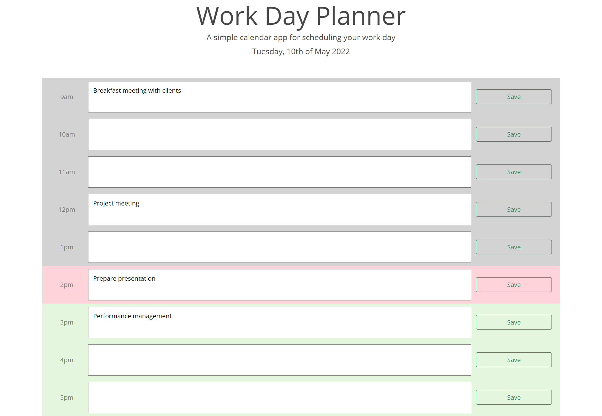

# day-planner

A simple calendar application that allows a user to save events for each hour of the day. This app will run in the browser and features dynamically updated HTML and CSS powered by jQuery.

## Deployed Page and Repository

[Deployed page](https://nsharma-uk.github.io/day-planner/)

[Repository](https://github.com/nsharma-uk/day-planner)
 
 

## Technologies

- HTML
- CSS

- JavaScript

- GitHub
- 3rd party Web APIs
  - Bootstrap
  - Moment.js
     
     

## Project Details

This browser app is for the employee with a busy schedule who wants to be able to add important events to a daily planner so that they are able to manage time effectively.

Moment.js was used to validate and display dates and times. Using a combination of jQuery and Javascript, the time blocks of a typical working day's dynamically were adjusted so that each time block is colour coded to indicate whether it is in the past, present, or future.  The past is greyed out, present is in pale pink and future is shaded in green.

The user can input text into the form and click on the save button ensuring the text is saved and persists, even when the page is refreshed.

The page was styled using a combination of Bootstrap and CSS.

 

## Authored by

N Sharma
 
 

## Contact

Email: nsharma711@gmail.com  
GitHub: [github.com/nsharma-uk](https://github.com/nsharma-uk) 
Twitter: [@NSharmaUK](https://twitter.com/NSharmaUK)
